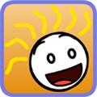

# Emotistick_iOS

[**_This app is removed from the app store_**]()

## Overview

This is emoji app for iOS 7.0 or above. The app provides several emoji icon and GIF on the list, and users can use them by copy & past to their app.

## Skills
    - Objective-C
    - Photo Processing
    - Emoji

# Contact Info

**_name_**:		_KmHk_
**_email_**:	[_kmhk.lu@aol.com_](mailto:kmhk.lu@aol.com)
**_git_**:		[_kmhk_](https://github.com/kmhk)

## Screenshots

